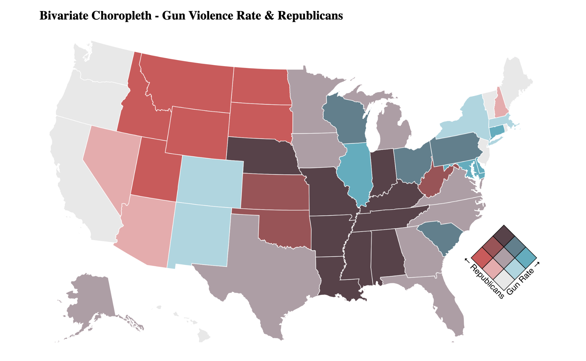

# Bivariate Choropleth: Gun Violence Rate & Republican Vote Percentage in the US

This project visualizes the relationship between **gun violence incidents** and **Republican vote percentage** in the United States using a **bivariate choropleth map**. The map highlights patterns across states for incidents per capita and voting behavior.


## **Data Sources**

1. **Gun Violence Incidents (2013–2022)**
   Source: [Gun Violence Archive](https://www.gunviolencearchive.org)

   * Filtered for incidents between **2019 and 2020**.
   * Grouped by state.
   * Counted total incidents per state.
   * **Cleaned dataset**: `[state, gun incident count]`.

2. **US State Population (2020 Census)**
   Source:[us population by state](https://www.kaggle.com/datasets/alexandrepetit881234/us-population-by-state)

   * Used to calculate per-capita gun violence rates.
   * **Cleaned dataset**: `[state, population]`.

4. **2020 US Election Votes**
  Source: [US Election Dataset](https://www.kaggle.com/datasets/essarabi/ultimate-us-election-dataset)
   * Percentage of Republican votes per state.
   * **Cleaned dataset**: `[state, % Republicans]`.

5. **CSV Files for Project:**
   [Download all required CSV files here](https://drive.google.com/drive/folders/1GeyRs_ODFIm-DsTjXGKTzu6kTxSg5fd9?usp=sharing)

---

## **Data Processing**

1. **Compute Gun Incident Rate per State**

   ```
   Gun Incident Rate = (Total Gun Incidents / Population) * 10,000
   ```

   Resulting in `[state, gun incident rate]`.

2. **Merge Datasets**
   Combined gun incident rate and Republican vote percentage per state:

   ```
   mergedData = [state, gun incident rate, % Republicans vote]
   ```

3. **Quantile Classification**

   * Sorted gun incident rates and Republican vote percentages.
   * Identified lower (33%) and upper (66%) quantiles.
   * Classified states into quantiles for **bivariate mapping**.

---

## **Visualization**

* **Map Type:** Bivariate choropleth.
* **X-axis:** Gun incident rate (low → high).
* **Y-axis:** Republican vote percentage (low → high).
* **Color Scheme:** Nine-color matrix representing combinations of quantiles.
* **Interactivity:** Hover over a state to display its gun incident rate and Republican vote percentage.

---

## **Methodology & Notes**

* **Bivariate Mapping:**
  Using a 3x3 quantile classification, each state is colored according to its **gun violence rate** and **Republican vote percentage**. This approach allows patterns and correlations to be visually interpreted across two variables simultaneously.

* **Quantiles:**
  The 33rd and 66th percentiles divide the data into three groups: **low**, **medium**, and **high**. This ensures roughly equal numbers of states in each category, improving visual balance.

* **Data Normalization:**
  Gun violence rates are normalized per 10,000 population to account for differences in state population sizes.

* **Interactivity:**
  Hover tooltips provide exact numeric values for each state, enabling precise interpretation alongside color classification.

---

## **Technologies**

* **JavaScript & D3.js (v6)** for data processing and visualization.
* **TopoJSON** for US state boundaries.
* **HTML/CSS** for page structure and styling.

---

## **File Structure**

```
project/
│
├─ index.html       # Main HTML file with embedded CSS
├─ script.js        # JavaScript for data processing and drawing the map
├─ all_incidents.csv
├─ us_pop_by_state.csv
├─ voting.csv
└─ README.md
```

---

## **How to Run**

1. Download all CSV files from [this Google Drive folder](https://drive.google.com/drive/folders/1GeyRs_ODFIm-DsTjXGKTzu6kTxSg5fd9?usp=sharing) and place them in the project folder.
2. Open `index.html` in a browser that supports ES6 modules.
3. The choropleth map will render automatically, with hover tooltips showing each state’s values.
